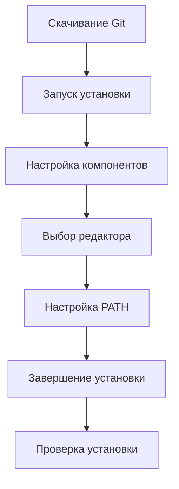
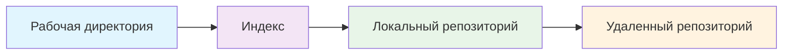

# 🚀 ДЕТАЛЬНАЯ ИНСТРУКЦИЯ ПО РАЗВЕРТЫВАНИЮ ПРОЕКТА НА GITHUB

<div align="center">


</div>

## 🎯 ОГЛАВЛЕНИЕ
1. [Установка Git](#1-установка-и-настройка-git)
2. [Регистрация на GitHub](#2-регистрация-на-github)
3. [Создание репозитория](#3-создание-репозитория)
4. [Клонирование проекта](#4-клонирование-и-настройка-локального-репозитория)
5. [Создание README](#5-создание-и-редактирование-readmemd)
6. [Коммит изменений](#6-коммит-и-отправка-изменений)
7. [Настройка коллаборации](#7-настройка-коллаборации)
8. [Отчет о работе](#8-отчет-о-проделанной-работе)

---

## 1. УСТАНОВКА И НАСТРОЙКА GIT

### 📥 Процесс установки Git

<div align="center">



</div>

### 🔧 Подробные шаги установки:

**Шаг 1.1:** Скачивание установщика
- Перейдите на: `https://git-scm.com/downloads`
- Нажмите кнопку загрузки для вашей ОС
- Сохраните файл в удобное место

**Шаг 1.2:** Запуск установки
```bash
# Дважды щелкните на скачанный файл:
git-2.xx.x-64-bit.exe
```

**Шаг 1.3:** Настройка параметров
- **Лицензия:** Примите соглашение ✓
- **Путь установки:** Оставьте по умолчанию
- **Компоненты:** Отметьте все рекомендуемые
- **Редактор:** Выберите "VS Code"
- **PATH:** "Git from command line and 3rd-party software"

**Шаг 1.4:** Проверка установки
```bash
# Откройте командную строку и выполните:
git --version
```
✅ **Успех:** `git version 2.xx.x`

### 🚨 ТАБЛИЦА РЕШЕНИЯ ПРОБЛЕМ УСТАНОВКИ

| Проблема | Симптомы | Решение |
|----------|----------|---------|
| **PATH не настроен** | `git: command not found` | Переустановить с правильными настройками PATH |
| **Права доступа** | Установка прерывается | Запустить установщик как администратор |
| **Конфликт версий** | Ошибки совместимости | Удалить старую версию, установить новую |

---

## 2. РЕГИСТРАЦИЯ НА GITHUB

### 📝 Процесс создания аккаунта

<div align="center">

| Шаг | Действие | Результат |
|-----|----------|-----------|
| 1 | Переход на github.com | Страница регистрации |
| 2 | Заполнение формы | Проверка данных |
| 3 | Подтверждение email | Активация аккаунта |
| 4 | Настройка профиля | Готовый аккаунт |

</div>

**Шаг 2.1:** Заполнение регистрационной формы
```
Username: [ваш-уникальный-логин]
Email: [действующий-email]
Password: [пароль-8+-символов]
```

**Шаг 2.2:** Подтверждение email
- Проверьте почту
- Найдите письмо от GitHub
- Нажмите "Verify email address"

### 🔐 ПРОВЕРКА РЕГИСТРАЦИИ

<div align="center">

```bash
✅ Аккаунт создан: https://github.com/[ваш-username]
✅ Email подтвержден: [ваш-email]
✅ Вход выполнен: Приветствие на главной странице
```

</div>

---

## 3. СОЗДАНИЕ РЕПОЗИТОРИЯ

### 🆕 Создание нового репозитория

**Шаг 3.1:** Навигация к созданию
```
Главная страница → "+" в правом углу → "New repository"
```

**Шаг 3.2:** Заполнение параметров
```yaml
Repository name: "my-new-project"
Description: "Учебный проект в рамках производственной практики"
Visibility: "Public"
Initialize: ✓ "Add a README file"
```

**Шаг 3.3:** Подтверждение создания
- Нажмите зеленую кнопку "Create repository"
- Дождитесь завершения процесса

### 🌐 РЕЗУЛЬТАТ СОЗДАНИЯ

<div align="center">


**URL вашего репозитория:**
```
https://github.com/[ваш-username]/my-new-project
```

</div>

---

## 4. КЛОНИРОВАНИЕ И НАСТРОЙКА ЛОКАЛЬНОГО РЕПОЗИТОРИЯ

### 💻 Локальная настройка проекта

**Шаг 4.1:** Клонирование репозитория
```bash
# Откройте терминал/командную строку
git clone https://github.com/[ваш-username]/my-new-project.git
cd my-new-project
```

**Шаг 4.2:** Настройка пользователя Git
```bash
git config --global user.name "Ваше Реальное Имя"
git config --global user.email "your-email@example.com"
```

### 📊 ПРОВЕРКА НАСТРОЙКИ

<div align="center">

| Команда | Ожидаемый результат |
|---------|---------------------|
| `git status` | `On branch main` |
| `git config --list` | Ваши настройки пользователя |
| `dir` (Windows) / `ls` (Linux) | Файл `README.md` в списке |

</div>

---

## 5. СОЗДАНИЕ И РЕДАКТИРОВАНИЕ README.MD

### 📖 Создание профессионального README

**Шаг 5.1:** Открытие проекта в VS Code
```bash
code .
```

**Шаг 5.2:** Редактирование README.md
Замените содержимое на следующий код:

````markdown
# 🚀 My New Project

<div align="center">


**Учебный проект в рамках производственной практики**

</div>

## 📚 Информация о проекте

<div align="center">

| 📋 | 🏫 | 👥 | 💻 | 👨‍🎓 | 📖 | 🏢 |
|----|----|----|----|-----|----|----|
| **Проект** | **Колледж** | **Группа** | **Специальность** | **Студент** | **Дисциплина** | **Корпус** |

</div>

### 🎯 Детали проекта
| Параметр | Значение |
|----------|----------|
| **🎓 Колледж** | ПК Им. П. А. Овчинникова |
| **👥 Группа** | [Ваша группа] |
| **💻 Специальность** | 09.02.07 Информационные системы и технологии программирования |
| **👨‍🎓 Студент** | [Ваше ФИО] |
| **📖 Дисциплина** | Учебная практика |
| **🏢 Корпус** | "Шенкурский" |
| **📅 Год** | 2024 |

## 🏗️ Структура проекта

```bash
my-new-project/
└── README.md          # Документация проекта
```
````

**Шаг 5.3:** Заполнение ваших данных
- Замените `[Ваша группа]` на номер вашей группы
- Замените `[Ваше ФИО]` на ваше полное имя

### 💾 СОХРАНЕНИЕ И ПРОВЕРКА

<div align="center">

```bash
# Сохраните файл в VS Code: Ctrl + S
# Проверьте содержимое:
cat README.md
```


</div>

---

## 6. КОММИТ И ОТПРАВКА ИЗМЕНЕНИЙ

### 🔄 Работа с системой контроля версий

**Шаг 6.1:** Проверка изменений
```bash
git status
```
✅ **Должен показать:** `modified: README.md`

**Шаг 6.2:** Добавление файлов в коммит
```bash
git add .
git status  # Должен показать файлы готовые к коммиту
```

**Шаг 6.3:** Создание коммита
```bash
git commit -m "Оформление README.md с информацией о проекте"
```

**Шаг 6.4:** Отправка на GitHub
```bash
git push origin main
```

### 📈 ВИЗУАЛИЗАЦИЯ ПРОЦЕССА GIT

<div align="center">



</div>

---

## 7. НАСТРОЙКА КОЛЛАБОРАЦИИ

### 👥 Добавление collaborator

**Шаг 7.1:** Навигация к настройкам
```
Репозиторий → Settings → Collaborators → Add people
```

**Шаг 7.2:** Добавление пользователя
```
Username: Dedyretti
```

**Шаг 7.3:** Подтверждение
- Нажмите "Add Dedyretti to this repository"
- Дождитесь подтверждения

### ✅ ПРОВЕРКА ДОСТУПА

<div align="center">

| Проверка | Статус |
|----------|--------|
| Пользователь в списке collaborators | ✅ |
| Приглашение отправлено | ✅ |
| Доступ предоставлен | ✅ |


</div>

---

## 8. ОТЧЕТ О ПРОДЕЛАННОЙ РАБОТЕ

<div align="center">

# 📊 ОТЧЕТ О ВЫПОЛНЕНИИ РАБОТЫ


</div>

### 🎯 ИНФОРМАЦИЯ О ПРОЕКТЕ

| Параметр | Значение |
|----------|----------|
| **📅 Дата выполнения** | `________________` |
| **👨‍💻 Студент** | `________________` |
| **🏫 Группа** | `________________` |
| **📁 Репозиторий** | `my-new-project` |

### ✅ ВЫПОЛНЕННЫЕ ЭТАПЫ

<div align="center">

| Этап | Статус | Примечания |
|------|--------|------------|
| **1. Установка Git** | □ | Версия: `________________` |
| **2. Регистрация GitHub** | □ | Username: `________________` |
| **3. Создание репозитория** | □ | Публичный доступ |
| **4. Клонирование проекта** | □ | Локальная копия создана |
| **5. Создание README.md** | □ | Профессиональное оформление |
| **6. Коммит и пуш** | □ | Изменения отправлены |
| **7. Настройка коллаборации** | □ | Dedyretti добавлен |

</div>

### 📁 СТРУКТУРА ПРОЕКТА

```bash
my-new-project/
└── 📄 README.md              # Основная документация
```

### 🔗 ССЫЛКИ НА РЕСУРСЫ

- **🌐 Репозиторий:** `https://github.com/________________/my-new-project`
- **👥 Collaborator:** `Dedyretti`
- **📊 Статистика:** `______` коммитов, `______` ветка, `______` файлов

### 📈 СТАТИСТИКА ВЫПОЛНЕНИЯ

<div align="center">


</div>

### 🎓 ВЫВОД О ПРОДЕЛАННОЙ РАБОТЕ

<div align="center">


</div>

#### ✅ ДОСТИГНУТЫЕ РЕЗУЛЬТАТЫ:

1. **🛠️ Успешная настройка рабочей среды**
   - [ ] Git установлен и настроен корректно
   - [ ] VS Code готов к работе с проектами
   - [ ] GitHub аккаунт активирован и проверен

2. **📁 Создание профессионального репозитория**
   - [ ] README.md содержит всю необходимую информацию
   - [ ] Оформление соответствует современным стандартам
   - [ ] Информация о проекте заполнена полностью

3. **👥 Организация командной работы**
   - [ ] Настроена система коллаборации
   - [ ] Предоставлен доступ преподавателю
   - [ ] Готовность к совместной разработке

4. **🔧 Освоение ключевых навыков Git**
   - [ ] Клонирование репозиториев
   - [ ] Создание коммитов и управление версиями
   - [ ] Работа с удаленными репозиториями

#### 💡 ПРИОБРЕТЕННЫЕ НАВЫКИ:

- **Технические навыки:**
  - [ ] Работа с системой контроля версий Git
  - [ ] Управление репозиториями на GitHub
  - [ ] Создание профессиональной документации

- **Профессиональные навыки:**
  - [ ] Следование инструкциям и техническим требованиям
  - [ ] Решение проблем и отладка
  - [ ] Организация рабочего процесса

#### 📝 РЕКОМЕНДАЦИИ ДЛЯ ДАЛЬНЕЙШЕЙ РАБОТЫ:

1. [ ] Регулярно совершать коммиты с осмысленными сообщениями
2. [ ] Использовать ветвление для разработки новых функций
3. [ ] Вести подробную документацию всех изменений
4. [ ] Освоить работу с Pull Requests для code review

#### 🎯 ОБЩАЯ ОЦЕНКА РАБОТЫ:

<div align="center">

| Критерий | Оценка | Комментарий |
|----------|--------|-------------|
| **Полнота выполнения** | □□□□□ | |
| **Качество оформления** | □□□□□ | |
| **Соблюдение сроков** | □□□□□ | |
| **Техническая грамотность** | □□□□□ | |

**Итоговая оценка:** `________________`

</div>

---

<div align="center">

## 🏆 ЗАКЛЮЧЕНИЕ


**Заполните все поля отчета и предоставьте ссылку на репозиторий!** 🚀

*Отчет должен быть заполнен после завершения всех этапов работы*

</div>